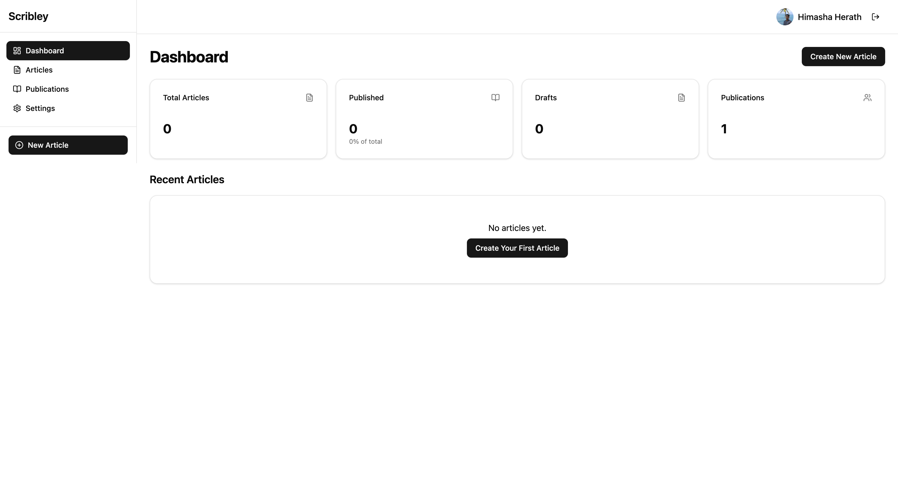

# Scribley 📝

<div align="center">


[](https://reactjs.org/)
[](https://www.typescriptlang.org/)
[](https://fastapi.tiangolo.com/)
[](https://www.python.org/)
[](https://www.sqlite.org/)
[](https://tailwindcss.com/)
[](https://docker.com/)

Modern Medium automation tool for content creators, writers, and publishers. Streamline your Medium workflow with a beautiful UI and powerful API.

[Features](#features) • [Installation](#installation) • [Usage](#usage) • [API](#api-endpoints) • [Contributing](#contributing) • [Security](#security)

</div>

---

## ✨ Features

Scribley makes your Medium writing workflow faster and more efficient:

- 🚀 **One-click publishing** to Medium from a beautiful UI
- 📊 **Publication management** for organizing your content
- 👥 **Contributor tracking** across your publications
- 📄 **Article management** with drafts and scheduled posting
- 🔄 **Sync with Medium API** for real-time updates
- 🏷️ **Tag management** for better content organization
- 🔍 **Search and filter** your articles and publications
- 💾 **Offline editing** with automatic syncing
- 🔒 **Secure authentication** with Medium API tokens
- ✏️ **Rich Text Editor** with Markdown support and formatting tools
- 🖼️ **Image management** with upload, alignment, and size control
- 📊 **Table support** for structured data in your articles
- 🌐 **Offline fallback** for image uploads when Medium API is unavailable

## ⚠️ Medium API Status

**Important Note**: Medium's official API was archived in March 2023. Scribley is currently using it in a limited capacity, but it may stop functioning at any time. Consider saving a backup of your content.

Alternative API options:
- **RapidAPI's Medium API**: A commercial API with tiered pricing
  - Free: 150 calls/month
  - PRO: $4.99/month
  - ULTRA: $24.99/month
  - MEGA: $149.95/month
- **Web Scraping**: A more advanced approach that may require additional maintenance

Scribley implements several fallback mechanisms to help you continue working even if the Medium API becomes unavailable:
- Local image storage fallback
- Draft saving to local database
- Export options for your content

## 📸 Screenshots

<div align="center">

</div>

## ✏️ Rich Text Editor

Scribley includes a powerful Rich Text Editor with:

- **Markdown Support**: Write in Markdown with real-time preview
- **Formatting Toolbar**: Easy access to common formatting options
- **Image Management**: Upload, align, and resize images with intuitive controls
- **Table Support**: Create and format tables for structured data
- **Code Blocks**: Share code with syntax highlighting
- **Blockquotes & Lists**: Organize your content effectively
- **Live Preview**: See how your content will look as you write
- **Offline Fallback**: Continue working even when API connectivity is limited

## 🖼️ Image Management

The integrated image upload system offers:

- Drag & drop or file browser upload options
- Image alignment controls (left, center, right)
- Image size presets (small, medium, large)
- Automatic error handling and validation
- Offline fallback with data URLs when Medium API is unavailable
- Secure file handling with size and type validation

## 🏗️ Project Structure

```
scribley/
├── client/             # React frontend
│   ├── public/         # Static assets
│   │   └── assets/     # Images and media files
│   ├── src/            # Source files
│   │   ├── components/ # UI components
│   │   ├── lib/        # Utilities and hooks
│   │   └── pages/      # Application pages
│   └── tests/          # Frontend tests
├── scribley/           # Python backend
│   ├── api/            # API endpoints
│   │   ├── routers/    # API route handlers
│   │   ├── schemas.py  # Pydantic schemas
│   │   └── medium.py   # Medium API client
│   ├── database/       # Database components
│   └── config/         # Configuration files
├── data/               # SQLite database storage
└── tests/              # Backend tests
```

## 🔧 Technology Stack

### Frontend
- **React** with TypeScript - Modern UI framework
- **Vite** - Fast development and building
- **Tailwind CSS** - Utility-first styling
- **shadcn UI** - Beautiful, accessible components
- **React Router** - Seamless navigation

### Backend
- **Python 3.9+** - Latest language features
- **FastAPI** - High-performance API framework
- **SQLAlchemy** - SQL toolkit and ORM
- **SQLite** - Reliable local database
- **Medium API** - Official integration with Medium

## 🚀 Installation

### Prerequisites
- Node.js (v18 or later)
- npm or yarn
- Python 3.9+
- pip
- Docker & Docker Compose (optional, for containerized setup)

### Quick Setup with Docker (Recommended)

The easiest way to get started is with Docker:

1. **Clone the repository**
   ```bash
   git clone https://github.com/HimashaHerath/scribley.git
   cd scribley
   ```

2. **Set up environment variables**
   ```bash
   cp env.example .env
   ```
   Edit the `.env` file and add your Medium API token.

3. **Start the application**
   ```bash
   docker-compose up -d
   ```

4. **Access the application**
   - Frontend: http://localhost:5173
   - Backend API: http://localhost:8080

### Manual Setup

1. **Clone the repository**
   ```bash
   git clone https://github.com/HimashaHerath/scribley.git
   cd scribley
   ```

2. **Create a virtual environment** (recommended)
   ```bash
   python -m venv venv
   # On Windows
   venv\Scripts\activate
   # On macOS/Linux
   source venv/bin/activate
   ```

3. **Install backend dependencies**
   ```bash
   pip install -r requirements.txt
   pip install -e .
   ```

4. **Install frontend dependencies**
   ```bash
   cd client
   npm install
   cd ..
   ```

5. **Set up your environment**

   Copy the environment example file:
   ```bash
   cp env.example .env
   ```
   
   Edit the `.env` file and add your Medium API token:
   ```
   MEDIUM_API_TOKEN=your_medium_api_token_here
   ```
   
   > 🔑 **Get your Medium API token** from [Medium Settings](https://medium.com/me/settings) → Integration tokens

## 🏃‍♂️ Running the Application

### Using Docker

If you've set up with Docker, the application is already running at:
- Frontend: http://localhost:5173
- Backend API: http://localhost:8080

To stop the containers:
```bash
docker-compose down
```

### Manual Startup

1. **Start the backend server**
   ```bash
   python run_server.py
   ```
   Your API will be available at http://localhost:8080

2. **Start the frontend development server**
   ```bash
   cd client
   npm run dev
   ```
   Your app will be available at http://localhost:5173

## 📊 Database

Scribley uses SQLite for persistent storage, making it easy to set up and maintain.

### Models
- **User**: Medium user profile data
- **Publication**: Publication metadata and settings
- **Article**: Content, metadata, and publishing status
- **Tag**: Content categorization

### Maintenance

The database is automatically initialized on startup. To reset:

```bash
python tests/test_database.py --reset
```

## 🔌 API Endpoints

### Articles
| Endpoint | Method | Description |
|----------|--------|-------------|
| `/api/articles` | GET | List all articles with filtering |
| `/api/articles` | POST | Create a new article |
| `/api/articles/{id}` | GET | Get a specific article |
| `/api/articles/{id}` | PUT | Update an article |
| `/api/articles/{id}` | DELETE | Delete an article |
| `/api/articles/{id}/publish` | POST | Publish to Medium |

### Publications
| Endpoint | Method | Description |
|----------|--------|-------------|
| `/api/publications` | GET | List your publications |
| `/api/publications/{id}` | GET | Get a specific publication |
| `/api/publications/{id}/contributors` | GET | Get contributors |

### Users
| Endpoint | Method | Description |
|----------|--------|-------------|
| `/api/users/me` | GET | Get your user information |
| `/api/users/me/publications` | GET | Get your publications |

## 🖥️ Usage Examples

### Working with Publications

View all your publications and their contributors. Each publication card shows:
- Publication name and image
- Description
- Link to Medium
- Contributor list organized by role

### Managing Articles

Create, edit, and publish articles directly to Medium:
- Write in Markdown or rich text
- Add tags for better discoverability
- Choose a publication to post to
- Set publish status (draft, public, unlisted)
- Schedule posts for future publication

### Command Line Usage

```bash
# Post an article to Medium
python -m scribley.cli post --file articles/your-article.md --title "Your Article Title" --tags "tag1,tag2"

# List your publications
python -m scribley.cli publications

# Schedule an article
python -m scribley.cli schedule --file articles/your-article.md --publish-at "2023-06-20 14:30"
```

## 🔐 Security

### Best Practices

1. **API Tokens**
   - Never commit your Medium API token to version control
   - Always use environment variables for sensitive data
   - Rotate your Medium API token periodically (use `scripts/rotate_token.py`)
   - Store tokens in a secure credential manager when not in use

2. **CORS Configuration**
   - For production, restrict allowed origins to your specific domains in `.env`:
     ```
     CORS_ORIGINS=https://yourdomain.com,https://api.yourdomain.com
     ```
   - Set `DEBUG=false` in production to enable stricter CORS settings
   - Limit exposed headers to only what's necessary

3. **Database Security**
   - The database file (`data/scribley.db`) is excluded from git tracking
   - Use proper file permissions (600) for the database file
   - Consider encryption at rest for sensitive data
   - In production, consider using a more robust database solution

4. **Secret Detection**
   - Use the included pre-commit hooks to scan for accidental secret exposure:
     ```bash
     pip install pre-commit
     pre-commit install
     ```
   - Run periodic scans on your codebase with `gitleaks`
   - Set up automated secret scanning in your CI/CD pipeline

5. **Token Rotation**
   - Run the included token rotation utility when updating tokens:
     ```bash
     python scripts/rotate_token.py -t your-new-token
     ```
   - Schedule regular token rotation (recommended every 90 days)
   - Validate token health with:
     ```bash
     python scripts/rotate_token.py --validate-only
     ```

### Security Updates

The project is regularly updated to address security vulnerabilities. If you find a security issue, please report it via email rather than opening a public issue.

## 🔍 Troubleshooting

### Common Issues

**API Token Invalid**
- Verify your token at [Medium Settings](https://medium.com/me/settings)
- Check that the token is correctly set in your `.env` file:
  ```bash
  cat .env | grep MEDIUM_API_TOKEN
  ```
- Make sure there are no whitespace or quotes around the token
- Validate your token with the token utility:
  ```bash
  python scripts/rotate_token.py --validate-only
  ```

**Database Connection Error**
- Ensure the `data` directory exists and is writable:
  ```bash
  mkdir -p data
  chmod 700 data
  ```
- Try resetting the database with `python tests/test_database.py --reset`
- For Docker: make sure volume mounts are correctly configured
- Check file permissions on the database file:
  ```bash
  chmod 600 data/scribley.db
  ```

**Frontend Not Connecting to Backend**
- Confirm the backend is running at http://localhost:8080
  ```bash
  curl http://localhost:8080/
  ```
- Check that the `VITE_API_URL` is set correctly in your frontend environment
- Verify CORS settings in `scribley/api/app.py` if using custom domains
- Use browser developer tools to check for CORS errors in the console

**Docker Issues**
- Run `docker-compose logs` to check for error messages
- Ensure ports 8080 and 5173 are not already in use:
  ```bash
  lsof -i :8080
  lsof -i :5173
  ```
- Try rebuilding with `docker-compose build --no-cache`
- Check environment variable passing with:
  ```bash
  docker-compose exec backend env | grep MEDIUM
  ```

**Token Rotation Issues**
- If the token rotation script fails, check Python dependencies:
  ```bash
  pip install requests python-dotenv
  ```
- Ensure you have proper permissions to write to the `.env` file
- For manual rotation, edit the `.env` file directly

## 🤝 Contributing

Contributions are welcome! Here's how to get started:

1. Fork the repository
2. Create a feature branch (`git checkout -b feature/amazing-feature`)
3. Make your changes
4. Commit your changes (`git commit -m 'Add some amazing feature'`)
5. Push to the branch (`git push origin feature/amazing-feature`)
6. Open a Pull Request

Please make sure your code follows our coding standards and includes tests.

## 📝 License

This project is licensed under the MIT License - see the [LICENSE](LICENSE) file for details.

---

<div align="center">
Made with ❤️ for Medium writers everywhere
</div>

## 🤝 Contributing

Contributions are welcome! Here's how to get started:

1. Fork the repository
2. Create a feature branch (`git checkout -b feature/amazing-feature`)
3. Make your changes
4. Commit your changes (`git commit -m 'Add some amazing feature'`)
5. Push to the branch (`git push origin feature/amazing-feature`)
6. Open a Pull Request

Please make sure your code follows our coding standards and includes tests.

## 📝 License

This project is licensed under the MIT License - see the [LICENSE](LICENSE) file for details. 